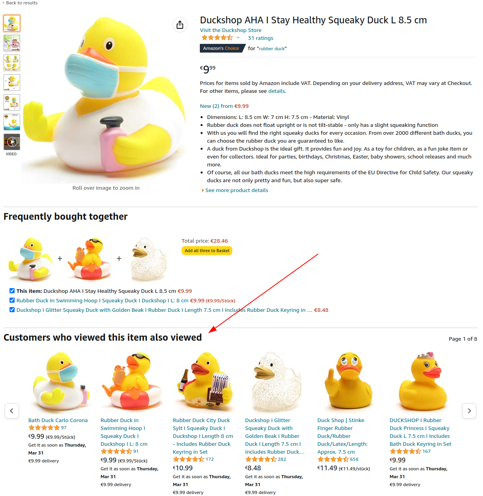

# Recommendation engine

The goal is to build a recommendation engine, see an example below:

## Given code

Code is available here [./ts-classes](./ts-classes) & here [./ts-functions](./ts-functions)

## Requirements

- Show only items whose category is the same
- If customer has spent more than 100$ before, offer three items from the same category with the highest price
- If customer has not yet bought anything, offer three items from the same category with the lowest price
- Store the items recommended on each lookup (so that they could be sent in the email later for example)
